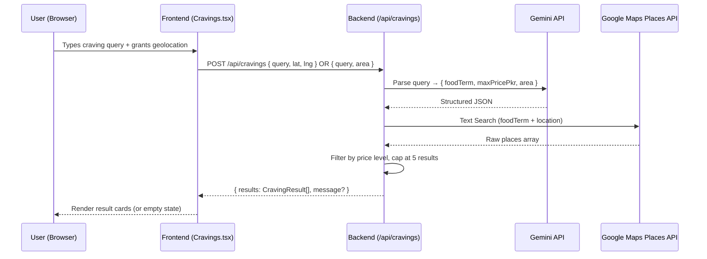

# Design Document — Local Search Enhancement

## Overview

This feature replaces the hard-coded mock data in MealMind's Cravings page with real restaurant results. The user types a natural-language craving query (e.g., "spicy zinger burger under 800 Rs nearby"). The MealMind Backend uses the existing Gemini integration to parse the query into structured fields, then calls the Google Maps Places Text Search API to retrieve real nearby restaurants. Results are filtered by price level and returned to the frontend, which renders them with skeleton loaders, an empty state, and actionable order links.

---

## Architecture



---

## Components and Interfaces

### Backend — new endpoint `POST /api/cravings`

Added to `backend/server.js` alongside the existing `/api/recommend` endpoint.

**Request body:**
```ts
{
  query: string;           // raw user craving text
  lat?: number;            // from browser geolocation
  lng?: number;            // from browser geolocation
  area?: string;           // fallback manual area string
}
```

**Response body (success):**
```ts
{
  results: CravingResult[];
  message?: string;        // present when results is empty
}
```

**Response body (error):**
```ts
{
  error: string;           // human-readable message
}
```

#### Sub-components

| Name | Responsibility |
|---|---|
| `parseQuery(query)` | Calls Gemini to extract `{ foodTerm, maxPricePkr?, area? }` from free text |
| `searchPlaces(foodTerm, location)` | Calls Google Maps Text Search, returns raw places array |
| `filterByPrice(places, maxPricePkr?)` | Applies Price Tier Mapping, removes results above ceiling |
| `formatResults(places)` | Maps raw Google Maps place objects to `CravingResult` shape |

### Frontend — updated `Cravings.tsx`

| Change | Detail |
|---|---|
| Geolocation hook | `useGeolocation()` — requests coords on mount, exposes `{ lat, lng, denied }` |
| Area input | Rendered when `denied === true`; required before form submit |
| Skeleton loader | `SkeletonCard` component (3 instances while loading) |
| Empty state | Shown when `results.length === 0` with a suggestion message |
| Error state | Shown when the API returns a non-200 response |
| Result card | Unchanged visual shape; `distance`, `price`, `rating` now real data |

### New component: `SkeletonCard`

File: `frontend/src/components/SkeletonCard.tsx`

A single animated placeholder card matching the height of a result card. Used in groups of 3.

---

## Data Models

### `ParsedQuery` (backend-internal)
```ts
interface ParsedQuery {
  foodTerm: string;       // e.g. "zinger burger"
  maxPricePkr?: number;   // e.g. 800
  area?: string;          // e.g. "DHA Phase 4, Lahore" (from query or request body)
}
```

### `CravingResult` (shared shape, frontend + backend)
```ts
interface CravingResult {
  id: string;             // Google Maps place_id
  name: string;           // restaurant name
  address: string;        // formatted_address from Places API
  distanceKm: number;     // straight-line distance from user coords (haversine)
  priceLevel: number;     // 1–4 from Google Maps (0 if not provided)
  rating: number;         // 0–5 from Google Maps
  orderLink: string;      // https://maps.google.com/?cid=<place_id>
}
```

### Price Tier Mapping (backend constant)
```ts
const PRICE_TIER_MAP = [
  { maxPkr: 400,  priceLevel: 1 },
  { maxPkr: 800,  priceLevel: 2 },
  { maxPkr: 1500, priceLevel: 3 },
  { maxPkr: Infinity, priceLevel: 4 },
];
// Usage: find the first entry where maxPricePkr <= entry.maxPkr → that entry's priceLevel is the ceiling
```

### Environment variables added
| Variable | Location | Purpose |
|---|---|---|
| `GOOGLE_MAPS_API_KEY` | `backend/.env` | Authenticates Places API calls |

---

## Correctness Properties

*A property is a characteristic or behavior that should hold true across all valid executions of a system — essentially, a formal statement about what the system should do. Properties serve as the bridge between human-readable specifications and machine-verifiable correctness guarantees.*

### Property 1: Price filter ceiling

*For any* list of places with varying price levels and any `maxPricePkr` value, after applying `filterByPrice`, every result in the output must have a `priceLevel` less than or equal to the mapped ceiling for that `maxPricePkr`.

**Validates: Requirements 2.2**

---

### Property 2: Price tier mapping monotonicity

*For any* two PKR values A and B where A < B, the Price Level ceiling mapped from A must be less than or equal to the ceiling mapped from B (the mapping is non-decreasing).

**Validates: Requirements 2.4**

---

### Property 3: No-filter pass-through

*For any* list of places, when `maxPricePkr` is absent (undefined), `filterByPrice` must return the same list unchanged.

**Validates: Requirements 2.3**

---

### Property 4: Result count cap

*For any* Places API response containing N results (N ≥ 0), `formatResults` must return at most 5 items.

**Validates: Requirements 1.4**

---

### Property 5: Query parser round-trip structure

*For any* craving query string that contains a food term and an optional PKR amount, `parseQuery` must return a `ParsedQuery` object where `foodTerm` is a non-empty string and, when a PKR amount was present in the query, `maxPricePkr` is a positive finite number.

**Validates: Requirements 1.2, 2.1**

---

### Property 6: Order link format

*For any* result returned by `formatResults`, the `orderLink` field must be a valid URL string (parseable by the WHATWG URL constructor without throwing).

**Validates: Requirements 5.1**

---

## Error Handling

| Scenario | Backend behaviour | Frontend behaviour |
|---|---|---|
| `GOOGLE_MAPS_API_KEY` missing | Log warning at startup; return HTTP 500 with `{ error: "..." }` on request | Display error message in place of results |
| Gemini parse failure | Return HTTP 502 with `{ error: "..." }` | Display error message |
| Places API non-200 | Return HTTP 502 with `{ error: "..." }` | Display error message |
| Places API returns 0 results | Return HTTP 200 with `{ results: [], message: "No restaurants found..." }` | Render empty state with suggestion |
| Geolocation denied | N/A | Show Area Input field; block form submit until filled |

---

## Testing Strategy

### Property-Based Testing (fast-check)

The backend pure functions (`parseQuery`, `filterByPrice`, `formatResults`, price tier mapping) are the primary targets for property-based testing. We use **fast-check** (npm package) for the Node.js backend.

- Each property-based test runs a minimum of **100 iterations**.
- Each test is tagged with a comment in the format: `// Feature: local-search-enhancement, Property N: <property text>`
- Each correctness property from this document maps to exactly one property-based test.

### Unit Tests (Vitest)

The frontend uses **Vitest** (added as a dev dependency) for unit tests.

- `useGeolocation` hook: test granted, denied, and unavailable states with mocked `navigator.geolocation`.
- `SkeletonCard`: renders without crashing.
- `Cravings` page: renders skeleton loaders while loading, renders result cards on success, renders empty state on empty results, renders error message on API error.

### Integration

- Manual smoke test: submit a real query with geolocation enabled and verify real restaurant cards appear.
- The `/api/cravings` endpoint is tested with `supertest` for the happy path and each error scenario.
